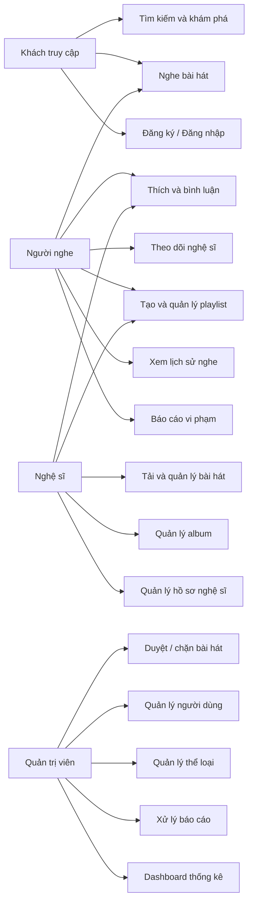

# USE CASE – CLOUDMUSIC

## 1. Tác nhân

- **Khách truy cập:** chưa đăng nhập.
- **Người nghe:** tài khoản listener.
- **Nghệ sĩ:** tài khoản artist, có toàn bộ quyền của người nghe và quyền đăng nhạc.
- **Quản trị viên:** tài khoản admin, quản lý toàn hệ thống.

## 2. Danh sách use case

| Mã | Tác nhân | Use case | Kết quả |
|---|---|---|---|
| UC-01 | Khách | Đăng ký | Tạo tài khoản listener hoặc artist |
| UC-02 | Mọi tài khoản | Đăng nhập/đăng xuất | Tạo hoặc hủy phiên đăng nhập |
| UC-03 | Mọi người | Tìm kiếm âm nhạc | Nhận danh sách bài hát/nghệ sĩ phù hợp |
| UC-04 | Mọi người | Nghe bài hát | Stream âm thanh và tua bằng Range |
| UC-05 | Người nghe | Thích bài hát | Thêm/xóa bài trong thư viện yêu thích |
| UC-06 | Người nghe | Bình luận/trả lời | Tạo thảo luận dưới bài hát |
| UC-07 | Người nghe | Theo dõi nghệ sĩ | Quản lý danh sách đang theo dõi |
| UC-08 | Người nghe | Tạo playlist | Tạo danh sách công khai hoặc riêng tư |
| UC-09 | Người nghe | Quản lý bài trong playlist | Thêm, xóa và đổi thứ tự bài hát |
| UC-10 | Người nghe | Xem lịch sử | Xem bài đã nghe và vị trí dừng |
| UC-11 | Nghệ sĩ | Tải bài hát | Upload audio, cover và metadata |
| UC-12 | Nghệ sĩ | Quản lý bài hát | Sửa/xóa bài thuộc sở hữu |
| UC-13 | Mọi tài khoản | Chỉnh sửa hồ sơ | Đổi tên, mô tả và avatar |
| UC-14 | Người dùng | Báo cáo vi phạm | Gửi nội dung cho admin xem xét |
| UC-15 | Admin | Duyệt bài hát | Published/rejected/blocked/pending |
| UC-16 | Admin | Quản lý người dùng | Phân quyền và khóa tài khoản |
| UC-17 | Admin | Quản lý thể loại | Thêm, sửa, bật/tắt thể loại |
| UC-18 | Admin | Xử lý báo cáo | Reviewing/resolved/dismissed |
| UC-19 | Admin | Xem dashboard | Theo dõi người dùng, bài hát, lượt nghe |

## 3. Đặc tả use case trọng tâm

### UC-04 – Nghe bài hát

**Tiền điều kiện:** Bài hát ở trạng thái published và công khai; hoặc người yêu cầu là chủ sở hữu/admin.

**Luồng chính:**

1. Người dùng bấm nút Play.
2. Player đưa bài vào hàng chờ và gọi route stream.
3. Backend kiểm tra quyền và sự tồn tại của file.
4. Backend đọc header `Range`, trả `200` hoặc `206` cùng `Content-Range`.
5. Player hiển thị tên, nghệ sĩ, ảnh bìa, thời gian và tiến trình.
6. Người dùng có thể pause, tua, đổi âm lượng, next/previous, shuffle và repeat.
7. Sau ngưỡng nghe tối thiểu, frontend gửi sự kiện played.
8. Backend chống trùng 30 phút, tăng play_count và lưu lịch sử nếu đã đăng nhập.

**Ngoại lệ:** File bị mất trả 404; Range sai trả 416; bài riêng tư không đủ quyền trả 404.

### UC-08 – Tạo playlist

**Tiền điều kiện:** Đã đăng nhập.

1. Người dùng nhập tên, mô tả, ảnh bìa và visibility.
2. Hệ thống validate dữ liệu và tạo slug duy nhất theo tài khoản.
3. Playlist được lưu và chuyển tới trang chi tiết.
4. Người dùng mở một bài hát, chọn playlist và thêm bài.
5. Hệ thống không tạo bản ghi trùng cùng bài trong cùng playlist.

### UC-11 – Tải bài hát

**Tiền điều kiện:** Tài khoản artist/admin đang hoạt động.

1. Nghệ sĩ chọn audio và cover.
2. JavaScript đọc metadata để điền thời lượng.
3. Backend validate định dạng, dung lượng, album thuộc sở hữu và metadata.
4. Audio được lưu private, cover được lưu public.
5. Bài hát được tạo ở trạng thái pending, trừ bài do admin đăng.
6. Nếu database lỗi, hệ thống xóa file vừa upload để tránh file rác.

### UC-15 – Duyệt bài hát

**Tiền điều kiện:** Admin đã đăng nhập.

1. Admin lọc danh sách theo trạng thái.
2. Admin nghe/xem thông tin bài hát.
3. Admin chọn published, rejected, pending hoặc blocked.
4. Hệ thống cập nhật trạng thái.
5. Chỉ bài published/public/đúng ngày phát hành mới xuất hiện trong khám phá.

## 4. Quy tắc nghiệp vụ

- Một username và email chỉ thuộc một tài khoản.
- Một nghệ sĩ không thể dùng album của nghệ sĩ khác khi đăng bài.
- Một người không thể tự theo dõi chính mình.
- Một người chỉ thích một bài một lần.
- Một bài chỉ xuất hiện một lần trong cùng playlist.
- Bài private không xuất hiện trong tìm kiếm.
- Bài có ngày phát hành tương lai chưa xuất hiện công khai.
- Admin được quyền vượt qua policy sở hữu thông qua Gate before.

## 5. Sơ đồ use case tổng quát

